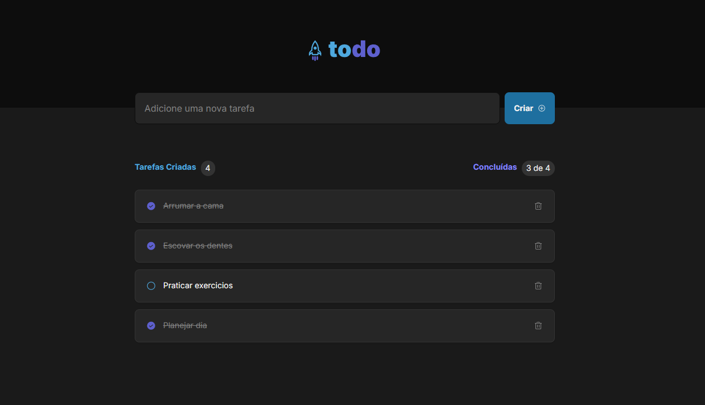

<h1 align="center" style="text-align: center;">
  
</h1>

<p align="center">
  <a href="#project">Projeto</a>&nbsp;&nbsp;&nbsp;|&nbsp;&nbsp;&nbsp;
  <a href="#technologies">Tecnologias</a>&nbsp;&nbsp;&nbsp;|&nbsp;&nbsp;&nbsp;
  <a href="#usage">Utilização</a>&nbsp;&nbsp;&nbsp;|&nbsp;&nbsp;&nbsp;
  <a href="#license">Licença</a>
</p>

<h2 id="project">📁 Projeto</h2>

O projeto consiste numa lista de tarefas que contém as seguintes funcionalidades:

- Adicionar uma nova tarefa
- Marcar e desmarcar uma tarefa como concluída
- Remover uma tarefa da listagem
- Mostrar o progresso de conclusão das tarefas



<h2 id="technologies">💻 Tecnologias</h2>

Este projeto foi desenvolvido com as tecnologias:

- React
- ReactDOM
- TypeScript
- Vite

<h2 id="usage">💡 Utilização</h2>

Você também pode executá-la em sua máquina localmente. Certifique-se de ter o `Node.js` e o `npm` instalados antes de prosseguir com as etapas abaixo:

1. Clone o projeto:

```
$ git clone https://github.com/ryanadriel/todo-list.git
```

2. Acesse a pasta do projeto:

```
$ cd todo-list
```

3. Instale as dependências:

```
$ npm install
```

4. Inicie o servidor:

```
$ npm run dev
```


